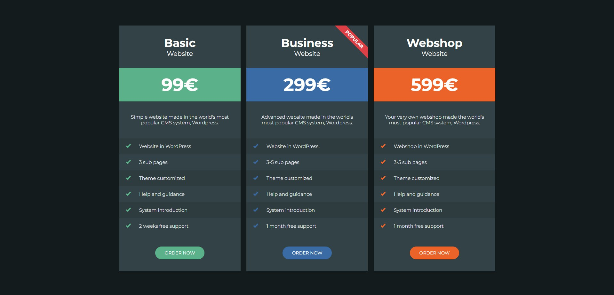

# 🎨Price-cards layout project

  

**📏Layout is adaptive and supports correctly devices from 320px screen-width**

### ⚙️Used technologies:

- HTML5
- CSS3
- Flexbox
- SASS preprocessor
- Mobile-first methodology
- BEM methodology

Page available via **[link](https://andrii618.github.io/price-cards_layout/)** 👈🏻

Developed by **[Andrii Shevchuk](https://github.com/Andrii618/)**
